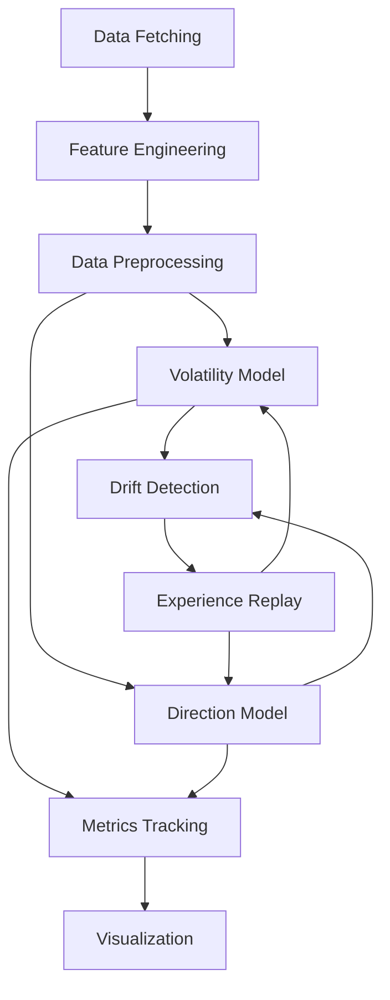

# Online Trading Model with Concept Drift Handling

## Overview
This Python project implements an adaptive online learning system for financial trading that handles concept drift in market conditions. The system:
1. Fetches real-time stock/ETF data
2. Engineers technical features
3. Trains two models simultaneously:
   - Volatility prediction (linear regression)
   - Price direction classification (adaptive random forest)
4. Detects and adapts to concept drift
5. Optimizes decision thresholds dynamically
6. Visualizes performance metrics

## Key Features

### 1. Adaptive Learning System
- **Volatility Prediction**: Linear regression model for forecasting market volatility
- **Direction Classification**: Adaptive Random Forest classifier for price movement prediction
- **Concept Drift Handling**: ADWIN detectors identify changing market conditions
- **Experience Replay**: Episodic memory stores important market patterns

### 2. Feature Engineering
- **Technical Indicators**:
  - RSI (Relative Strength Index)
  - MACD (Moving Average Convergence Divergence)
  - Bollinger Bands
  - Volatility regimes
  - Volume analysis
- **Temporal Features**:
  - Day of week, month, and day of month patterns

### 3. Dynamic Adaptation
- **Threshold Optimization**: Automatically adjusts classification threshold based on F1 score
- **Drift Response**: Triggers experience replay when concept drift is detected
- **Rolling Metrics**: Tracks recent performance with 90-day rolling window

## Installation

```bash
pip install -r requirements.txt
```

**requirements.txt:**
```
yfinance
pandas
numpy
river
scikit-learn
matplotlib
```

## Usage

### 1. Configure Assets
Edit the `tickers` dictionary to add assets:
```python
tickers = {
    'AAPL': 'stock',
    'MSFT': 'stock',
    'SPY': 'ETF',
    'QQQ': 'ETF'
}
```

### 2. Run the Model
```bash
python trading_model.py
```

### 3. Output Files
- `enhanced_trading_model_results.csv`: Prediction results
- `*_performance.png`: Visualization charts for each asset
- `volatility_memory.json`: Stored volatility patterns
- `direction_memory.json`: Stored price direction patterns

## Model Architecture



## Key Components

### 1. Data Pipeline
```python
# Data fetching with retries
df = fetch_data(tickers, period='3y')

# Feature engineering
df = engineer_features_and_targets(df)

# Preprocessing pipeline
preproc = compose.TransformerUnion(
    compose.SelectType((float,)) | preprocessing.StandardScaler(),
    compose.SelectType((object,)) | OneHotEncoder()
)
```

### 2. Machine Learning Models
**Volatility Prediction:**
```python
vol_model = LinearRegression(
    optimizer=SGD(0.005),
    intercept_lr=0.05,
    l2=0.01
)
```

**Direction Classification:**
```python
dir_model = ARFClassifier(
    n_models=15,
    drift_detector=ADWIN(),
    warning_detector=ADWIN(),
    seed=42,
    lambda_value=6  
)
```

### 3. Drift Adaptation System
```python
# Drift detectors
vol_drift_detector = ADWIN()
dir_drift_detector = ADWIN()

# Episodic memory
memory_vol = EnhancedEpisodicMemory(replay_size=100)
memory_dir = EnhancedEpisodicMemory(replay_size=100)

# Threshold optimization
threshold_optimizer = DirectionThresholdOptimizer()
```

### 4. Evaluation Metrics
**Tracked Metrics:**
```python
metrics_dict = {
    'vol_mae': metrics.MAE(),
    'vol_rmse': metrics.RMSE(),
    'vol_r2': metrics.R2(),
    'dir_accuracy': metrics.Accuracy(),
    'dir_precision': metrics.Precision(),
    'dir_recall': metrics.Recall(),
    'dir_f1': metrics.F1(),
    'dir_roc_auc': metrics.ROCAUC(),
    'dir_geometric_mean': metrics.GeometricMean()
}
```

## Performance Visualization

The system generates three types of visualizations for each asset:

1. **Volatility Prediction**:
   - True vs predicted volatility
   - Shows model's ability to forecast market volatility

2. **Direction Prediction**:
   - True price direction (binary)
   - Predicted probability of price increase
   - Dynamic decision threshold

3. **Threshold Evolution**:
   - Shows how the classification threshold adapts over time
   - Reflects changing market conditions


## Configuration Options

### Time Periods
```python
# In fetch_data()
period='3y'  # 1y, 2y, 5y, etc.
interval='1d'  # 1m, 5m, 15m, 1h, 1d
```

### Model Parameters
```python
# In ARFClassifier()
n_models=15          # Number of trees in the forest
lambda_value=6       # Lambda parameter for Poisson distribution

# In DirectionThresholdOptimizer()
window_size=200      # Sample window for threshold optimization
step=0.05            # Threshold adjustment granularity
```

### Memory Settings
```python
# In EnhancedEpisodicMemory()
max_size=2000        # Maximum stored samples per asset
replay_size=100      # Samples to replay during adaptation
```

## Performance Metrics

The system tracks both instantaneous and rolling metrics:

| Metric | Description | Type |
|--------|-------------|------|
| vol_mae | Mean Absolute Error (volatility) | Instant & Rolling |
| vol_rmse | Root Mean Squared Error (volatility) | Instant |
| vol_r2 | R² Score (volatility) | Instant |
| dir_accuracy | Classification accuracy | Instant |
| dir_precision | Precision (direction) | Instant |
| dir_recall | Recall (direction) | Instant |
| dir_f1 | F1 Score (direction) | Instant & Rolling |
| dir_roc_auc | ROC AUC (direction) | Instant |
| dir_geometric_mean | Geometric mean | Instant |

## References

1. Montiel, J., et al. (2021). River: machine learning for streaming data in Python.
2. Bifet, A., & Gavaldà, R. (2007). Learning from time-changing data with adaptive windowing.
3. Oza, N. C., & Russell, S. J. (2001). Online bagging and boosting.
4. Yahoo Finance (2023). Financial data API.


